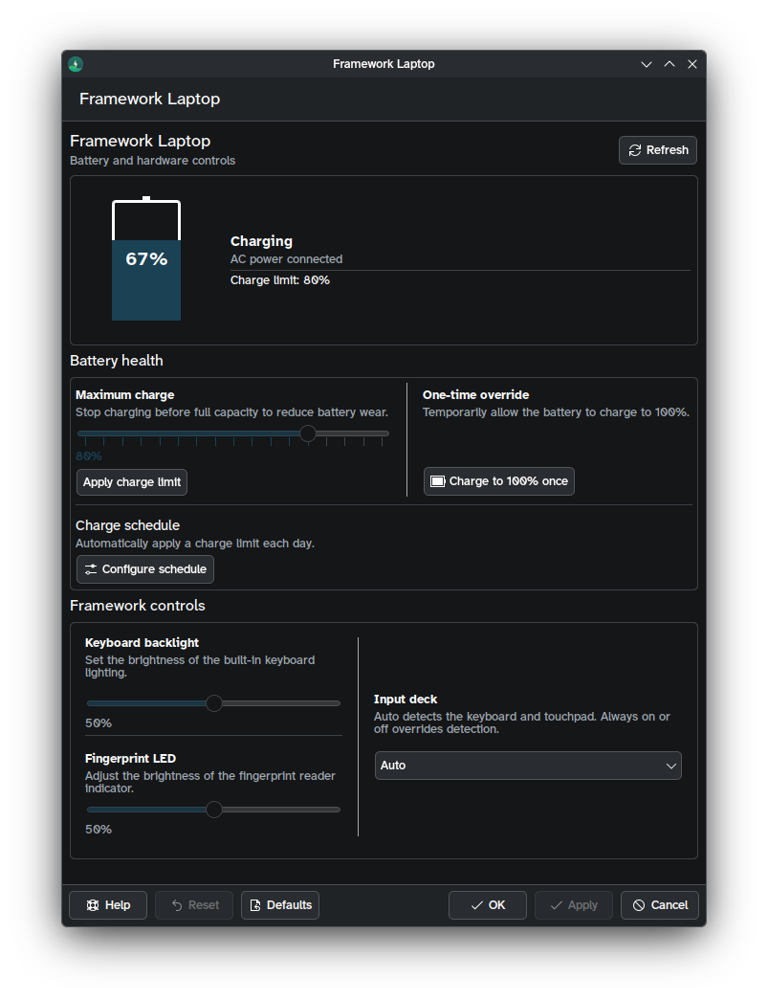

# Framework Laptop KDE Settings Pane

KDE lets you create custom settings panes, called KCMs. I saw a gap where Framework has a well-defined open source firmware tool, and there's no implementation as a KCM. You have to use it through the GUI.

This project changes that. It's still very work in progress, but it creates a settings pane and calls framework_tool on the backend.

Example screenshot (still early in development):



## Requirements

- Qt 6.5 or newer
- KDE Frameworks 6, including KCMUtils and Kirigami
- CMake 3.16 or newer
- Extra CMake Modules (ECM)
- `framework-system` providing `framework_tool` for hardware mode

On Fedora, the development dependencies can be installed with:

```sh
sudo dnf install gcc-c++ cmake extra-cmake-modules qt6-qtbase-devel \
    qt6-qtdeclarative-devel kf6-kcmutils-devel kf6-kirigami-devel kf6-ki18n-devel
```

## Compile

Configure and compile a debug build:

```sh
cmake -S . -B build -DCMAKE_BUILD_TYPE=Debug
cmake --build build
ctest --test-dir build --output-on-failure
```

For a release build:

```sh
cmake -S . -B build-release -DCMAKE_BUILD_TYPE=Release
cmake --build build-release
```

## Install

Install system-wide using `/usr`:

```sh
cmake -S . -B build-system -DCMAKE_BUILD_TYPE=Release -DCMAKE_INSTALL_PREFIX=/usr
cmake --build build-system
sudo cmake --install build-system
```

Install locally without root access:

```sh
cmake -S . -B build-user -DCMAKE_INSTALL_PREFIX="$HOME/.local"
cmake --build build-user
cmake --install build-user
```

The KCM must be installed before `kcmshell6` can discover it.

## Environment Setup

For a local installation, source the environment generated by KDE's CMake
setup:

```sh
source build-user/prefix.sh
```

For a custom prefix without `prefix.sh`, set the paths manually:

```sh
export QT_PLUGIN_PATH="$HOME/.local/lib64/plugins:$QT_PLUGIN_PATH"
export XDG_DATA_DIRS="$HOME/.local/share:$XDG_DATA_DIRS"
```

If KDE libraries are also installed under a non-standard prefix, add that
prefix to `CMAKE_PREFIX_PATH` before configuring CMake:

```sh
export CMAKE_PREFIX_PATH="$HOME/.local:$CMAKE_PREFIX_PATH"
```

## Run

On a Framework laptop with `framework_tool` installed:

```sh
kcmshell6 kcm_framework
```

You can also open System Settings on KDE and it'll show up automatically.

On a desktop without Framework hardware, use fixture mode. It simulates a 67%
battery, AC power, and an 80% charge limit. Hardware changes are kept in
memory and no Framework command is executed:

```sh
FRAMEWORK_KCM_FIXTURE=1 kcmshell6 kcm_framework
```

Hardware-specific fixture profiles are also available:

```sh
FRAMEWORK_KCM_FIXTURE=1 FRAMEWORK_KCM_FIXTURE_MODEL=framework-12 kcmshell6 kcm_framework
FRAMEWORK_KCM_FIXTURE=1 FRAMEWORK_KCM_FIXTURE_MODEL=framework-13 kcmshell6 kcm_framework
FRAMEWORK_KCM_FIXTURE=1 FRAMEWORK_KCM_FIXTURE_MODEL=framework-13-pro kcmshell6 kcm_framework
```

The profiles model these controls:

- `framework-12`: touchscreen, input deck, and tablet mode; no fingerprint LED or keyboard backlight
- `framework-12-gen2`: touchscreen, input deck, keyboard backlight, and tablet mode; no fingerprint LED
- `framework-13`: fingerprint LED, keyboard backlight, and input deck; no touchscreen or tablet mode
- `framework-13-pro`: fingerprint LED, keyboard backlight, touchscreen, and input deck; no tablet mode

## License

This project is licensed under GPL-3.0-or-later. That means this project will always be open source, and you may never create propriretary forks.

I felt this was necessary because open source should be the default. In an ideal world, permissive licenses wouldn't cause any issues, because all code would be open source. Unfortunately, we don't live in an ideal world, so this is GPL.
